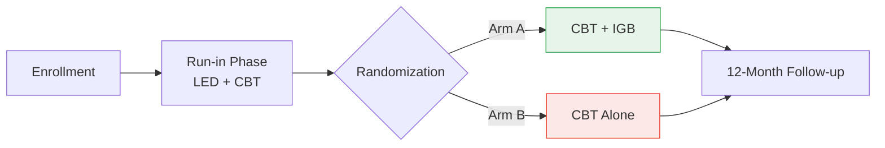
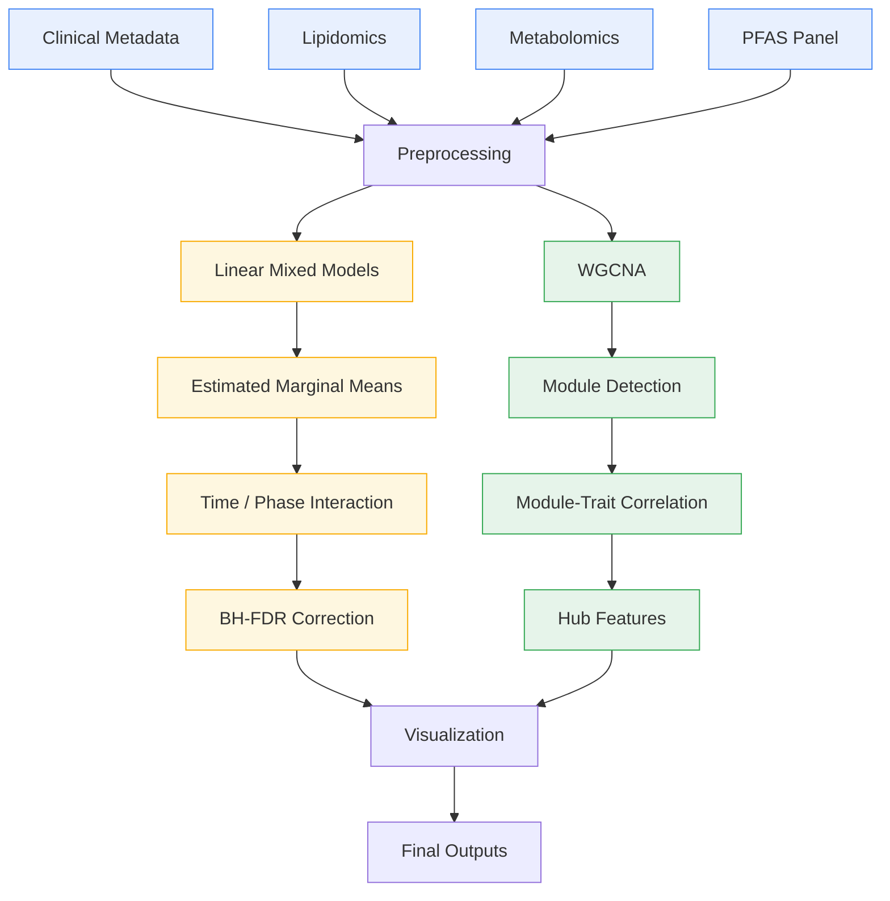
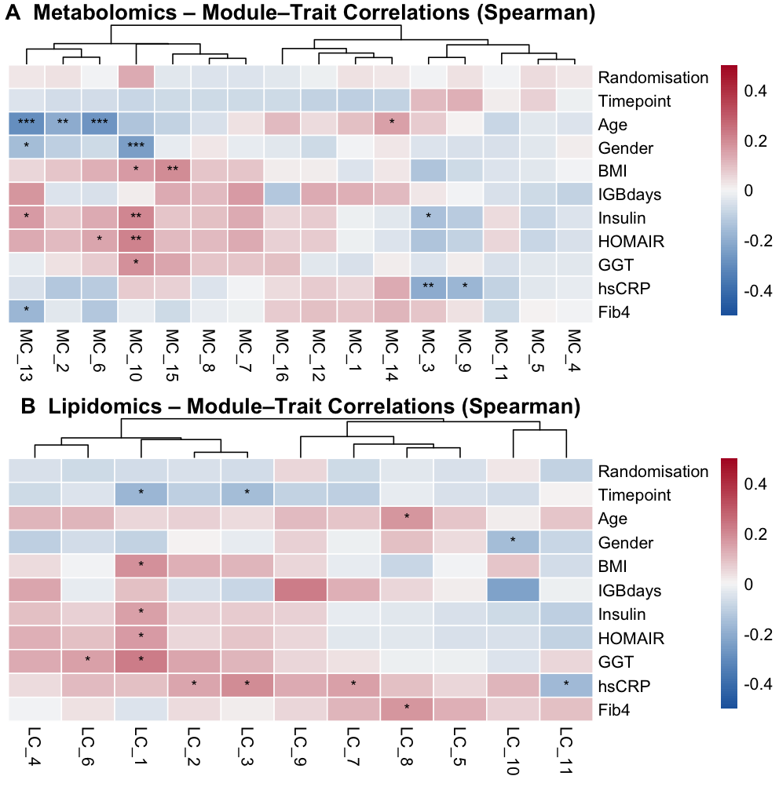

# Longitudinal Multi-Omics Analysis of Weight-Loss Interventions

### Lipidomic, Metabolomic & PFAS Trajectories in a Randomized Trial of CBT vs. CBT + Intragastric Balloon

[](https://www.r-project.org/)
[](LICENSE)
[](#citation)
[](https://doi.org/10.1111/dom.70865)

A reproducible R workflow for longitudinal multi-omics analysis of weight loss and weight regain, comparing group-based cognitive behavioural therapy (CBT) with and without an adjunct intragastric balloon (IGB).

**3** omics platforms &nbsp;·&nbsp; **3** timepoints &nbsp;·&nbsp; **2** treatment arms &nbsp;·&nbsp; **8**-analyte PFAS panel

## Table of Contents

- [🔬 Overview](#overview)
- [🧪 Study Design](#study-design)
- [✨ Key Features](#key-features)
- [🗂️ Repository Structure](#repository-structure)
- [🔄 Analysis Pipeline](#analysis-pipeline)
- [📊 Figures](#figures)
- [📈 Statistical Methods](#statistical-methods)
- [⚙️ Requirements and Installation](#requirements-and-installation)
- [▶️ Usage](#usage)
- [📦 Outputs](#outputs)
- [🔓 Data Availability](#data-availability)
- [📚 Related Publications](#related-publications)
- [📝 Citation](#citation)
- [🙏 Acknowledgments](#acknowledgments)
- [🤝 Contributing](#contributing)
- [⚖️ License](#license)
- [✉️ Contact](#contact)

## Overview

This repository contains the complete, reproducible R workflow for the multi-omics companion analysis of a randomized controlled obesity trial conducted at the Obesity Unit, Örebro University Hospital, Sweden.

Participants (adults with obesity, BMI 32.5–45 kg/m²) completed a run-in phase of low-energy diet (LED) plus group-based cognitive behavioural therapy (CBT), after which they were randomized to continue CBT with an adjunct intragastric balloon (IGB) or to continue CBT alone. This workflow integrates **lipidomics**, **metabolomics**, and an **8-analyte PFAS panel** with clinical phenotype data to characterize the molecular signatures that accompany weight loss and weight regain in both arms.

Circulating omics profiles were measured at three timepoints — **baseline (BL)**, **6 months (6M)**, and **12 months (12M)** — enabling full trajectory modeling rather than a single pre/post comparison.

> This repository accompanies an in-preparation manuscript. The parent clinical trial is published as Galavazi et al., *Diabetes, Obesity and Metabolism*, 2026 — see [Related Publications](#related-publications).

## Study Design



Lipidomic, metabolomic, and PFAS samples were collected at baseline, 6 months, and 12 months in both arms, allowing the pipeline to model complete three-timepoint trajectories rather than a single pre/post contrast.

## Key Features

**Longitudinal Modeling**
- Three complementary analysis frameworks: randomisation × time (omnibus interaction across BL / 6M / 12M), randomisation × phase (run-in vs. randomized phase), and net-change (BL → 12M)
- Estimated marginal means (EMMs) and pairwise contrasts via `emmeans`
- REML = FALSE enforced for valid likelihood-based model comparisons

**Network Analysis**
- WGCNA soft-thresholding, module detection, and module–trait correlation
- Hub feature identification within significant modules
- Reproducibility checks comparing single- and multi-threaded execution to verify stable module assignment

**Multi-Platform Integration**
- Shared, reusable helper functions (e.g. `select_traj_features()`) applied consistently across lipidomics, metabolomics, and PFAS
- 8-analyte PFAS panel analyzed with the same longitudinal framework as the other platforms
- Automated keyword-based flagging of biologically implausible annotations (e.g. plant hormones, mycotoxins) as likely artifacts

**Reporting**
- Benjamini–Hochberg FDR correction throughout
- Consistent visual language across figures (`pheatmap` heatmaps, `ggplot2` / `patchwork` multi-panel plots)
- Supplementary Excel tables with pre-write validation (sheet-name length, file-existence checks)

<details>
<summary><strong>Core reusable functions</strong></summary>
<br>

| Function | Purpose |
|---|---|
| `select_traj_features()` | Selects trajectory-eligible features shared across omics platforms |
| `run_lmm_interaction_phase()` | Fits the randomisation × phase linear mixed model |
| *(add additional exported functions here)* | |

</details>

## Repository Structure

```
obesity-multiomics-analysis/
├── Scripts_manuscript.Rmd     # Complete, consolidated analysis workflow
├── Scripts_manuscript.html    # Rendered analysis report
├── Figures/                   # Publication-ready figures (PDF/PNG)
├── Tables/                    # Supplementary tables
├── CITATION.cff               # Machine-readable citation metadata
├── LICENSE                    # MIT license
├── README.md
└── .gitattributes
```

## Analysis Pipeline



**Preprocessing** covers sample and feature filtering (missingness threshold), half-minimum imputation, log2 transformation, autoscaling, and metadata harmonization, applied identically across all three omics platforms before either branch of the analysis.

## Figures

The workflow generates publication-ready figures as matched PDF/PNG pairs. GitHub can only preview PNG (or other raster/SVG) images inline — a linked PDF shows as a download, not a thumbnail — so keeping a PNG export of each figure in `Figures/` is what makes them render directly in this README.

The workflow generates publication-ready figures as matched PDF/PNG pairs. GitHub can preview PNG (or other raster/SVG) images inline, while PDF files are available as high-resolution downloads. Both formats are therefore retained in the `Figures/` directory.


<p align="center">
  
  
</p>
<p align="center">
  
  
</p>

| Figure | Contents |
|---|---|
| `Figure_1` | *add caption* |
| `Figure_2` | *add caption* |
| `Figure_3` | *add caption* |
| `Figure_4` | PFAS longitudinal trajectories (8-analyte panel) |

> 💡 Only `Figure_4.pdf` is confirmed in the current repository. Add a PNG export for each figure and fill in the captions above — once filenames match, the gallery renders automatically with no other changes needed.

## Statistical Methods

| Component | Method | R Package(s) |
|---|---|---|
| Longitudinal modeling | Linear mixed-effects models (REML = FALSE for model comparison) | `lme4`, `lmerTest` |
| Post-hoc contrasts | Estimated marginal means, pairwise contrasts | `emmeans` |
| Group × Time interaction | Omnibus interaction across BL / 6M / 12M | `lmerTest`, `emmeans` |
| Group × Phase interaction | Run-in phase vs. randomized phase contrast | `lmerTest`, `emmeans` |
| Net-change analysis | BL → 12M change score by randomization arm | `lmerTest` |
| Multiple testing correction | Benjamini–Hochberg FDR | `stats::p.adjust` |
| Co-expression network analysis | Soft-thresholding, module detection, module–trait correlation, hub features | `WGCNA` |
| Correlation analysis | Spearman correlation | `stats` |

## Requirements and Installation

### Requirements
- R ≥ 4.3
- RStudio (recommended)

### Key Packages

| Package | Role |
|---|---|
| `tidyverse` | Data wrangling & general utilities |
| `lme4`, `lmerTest` | Linear mixed-effects models |
| `emmeans` | Estimated marginal means & contrasts |
| `WGCNA` | Weighted gene co-expression network analysis |
| `pheatmap`, `ComplexHeatmap` | Heatmap visualization |
| `ggplot2`, `patchwork`, `cowplot` | Figure composition |
| `broom.mixed` | Tidy model output extraction |
| `openxlsx` | Supplementary Excel table export |
| `janitor` | Data cleaning utilities |
| `readxl` | Excel file import |

### Installation

```r
# Clone the repository
git clone https://github.com/shashank-KU/obesity-multiomics-analysis.git
cd obesity-multiomics-analysis

# Install CRAN dependencies
install.packages(c("tidyverse", "lme4", "lmerTest", "emmeans",
                    "pheatmap", "ggplot2", "broom.mixed", "openxlsx",
                    "patchwork", "cowplot", "janitor", "readxl"))

# WGCNA and ComplexHeatmap rely on Bioconductor dependencies
if (!require("BiocManager", quietly = TRUE)) install.packages("BiocManager")
BiocManager::install(c("WGCNA", "ComplexHeatmap"))
```

## Usage

1. Open `Scripts_manuscript.Rmd` and update the file paths in the parameter section to point to your local data files.
2. Render the complete workflow:

   ```r
   rmarkdown::render("Scripts_manuscript.Rmd")
   ```

3. Review the rendered report (`Scripts_manuscript.html`) and the generated outputs in `Figures/` and `Tables/`.

## Outputs

Running the workflow produces:

- [x] Statistical result tables (LMM, EMM, FDR-corrected)
- [x] Estimated marginal means for all trajectory features
- [x] WGCNA module assignments and module–trait correlations
- [x] Publication-ready figures (PDF + PNG)
- [x] Supplementary Excel tables
- [x] Reproducible HTML manuscript report

## Data Availability

Raw participant-level omics and clinical data are not included in this repository, as they contain sensitive human research data.

Researchers interested in accessing the data should contact the corresponding authors and comply with the relevant institutional and ethical approval requirements.

## Related Publications

**Parent clinical trial**
Galavazi M, Shahed Q, Hesser H, Cao Y, Jansson S, van Nieuwenhoven M, Jendle J. Intragastric Balloon Treatment Enhances Weight Maintenance Adjunct to Low-Energy Diet and Group-Based Cognitive Behavioural Therapy: A Randomized Controlled Trial. *Diabetes, Obesity and Metabolism*. 2026. doi: [10.1111/dom.70865](https://doi.org/10.1111/dom.70865)

**This repository's manuscript**
In preparation — the citation below will be updated upon publication.

## Citation

If you use this workflow, please cite the associated publication once available. Machine-readable citation metadata is also provided in [`CITATION.cff`](CITATION.cff).

```bibtex
@article{gupta2026multiomics,
  author  = {Gupta, Shashank and others},
  title   = {TITLE TO BE ADDED},
  journal = {JOURNAL TO BE ADDED},
  year    = {2026},
  note    = {Manuscript in preparation --- citation will be updated upon publication}
}
```

## Acknowledgments

This work builds on a randomized controlled trial conducted at the Obesity Unit, Örebro University Hospital, Sweden, and reflects the combined efforts of the trial and omics research teams, including Johan Jendle, Marije Galavazi, Tuulia Hyötyläinen, and Matej Oresic. Data collection and laboratory analyses for the parent trial were supported by the Nyckelfonden Research Grant Fund, Region Örebro län.

*(Please confirm names, roles, and funding details before publication.)*

## Contributing

This repository accompanies an active research project. Questions, issues, and suggestions are welcome via [GitHub Issues](../../issues).

## License

Distributed under the MIT License. See [LICENSE](LICENSE) for full terms.

## Contact

**Shashank Gupta**
Researcher, School of Medical Sciences, Örebro University, Sweden
GitHub: [@shashank-KU](https://github.com/shashank-KU)

---

<p align="center"><sub>Built with R · Örebro University multi-omics obesity research team</sub></p>
